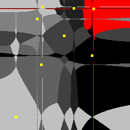
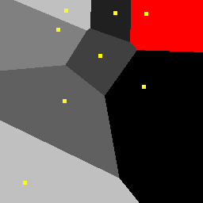
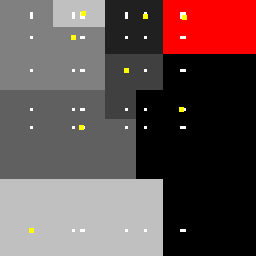
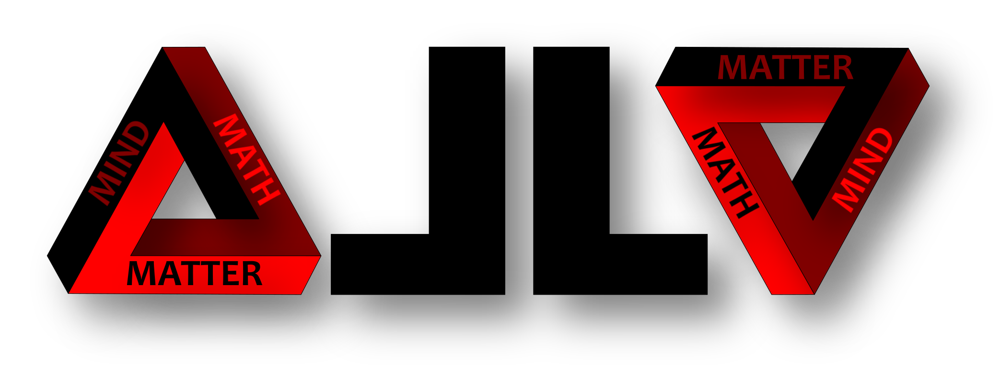

# 
Square (with) Voronois

Our goal is to make the NN algorithms with various distance functions equivalent (in some sense).
The following questions have already got their answer 
(because it looks like the **[Hanan grid](https://en.wikipedia.org/wiki/Hanan_grid)** provides a **(unique!)** answer to these questions!):
- Can two **1-NN** algorithms with distance functions $L_p$ and $L_q$, classify in the same way if $p\neq q$ for $0 < p,q < \infty$? 
- Can we learn an $Lq$-based **1-NN** classifier (with $q>0$ unknown and possibly varying) to behave predictably (*i.e.* exactly and like the $L_p$-based one, with a known $p>0$)?

Voronoi diagrams for the set $\mathcal{S}_{N}$ of $N = 8$ random patterns
|
:-:|:-: 
$p=\frac{1}{4}$|$p = 2$

$L_p$-agnostic Hanan-grid approximations $\mathcal{A}_{N}$ and $\mathcal{A}_{N+L}$ of the original set $\mathcal{S}_N$ with $p = 2$

|
|:---:|:---:|
|$N = 8$|$N = 8, L = 8$|

# 
¡Hola «⅄⅃LY»!

<!---  --->
